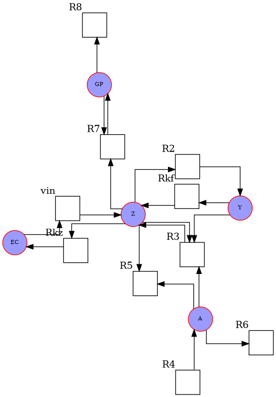
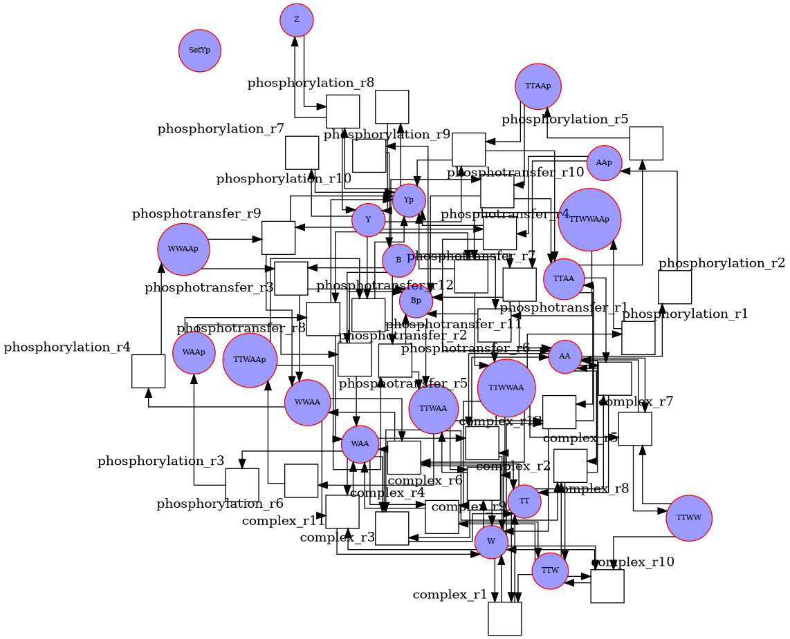

[](https://badge.fury.io/py/drawsbml)
[](https://github.com/dilawar/drawsbml/actions/workflows/python-app.yml)

# drawsbml

Draw Signalling Pathway in SBML.

# Install

```sh
python3 -m pip install drawsbml
```

You may have to install `graphviz` manually.

- graphviz
    `sudo apt install graphviz`


# Usage

```sh
drawsbml -i ./BIOMD0000000002.xml -o a.pdf
```

## help

```sh
drawsbml -h
```


## Examples

Following is the drawing of [this mode](https://www.ebi.ac.uk/biomodels-main/BIOMD0000000100)



Following is the drawing of [this model](https://www.ebi.ac.uk/biomodels-main/BIOMD0000000200)



# Need help

This is a very basic script for quickly plotting a moderate size SBML model.

In case, you need help of want enhancement, please open an issue on this repository. Attach your SBML model file.
