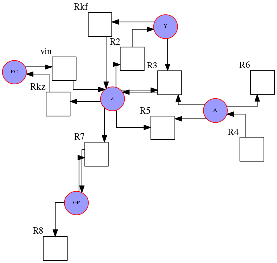
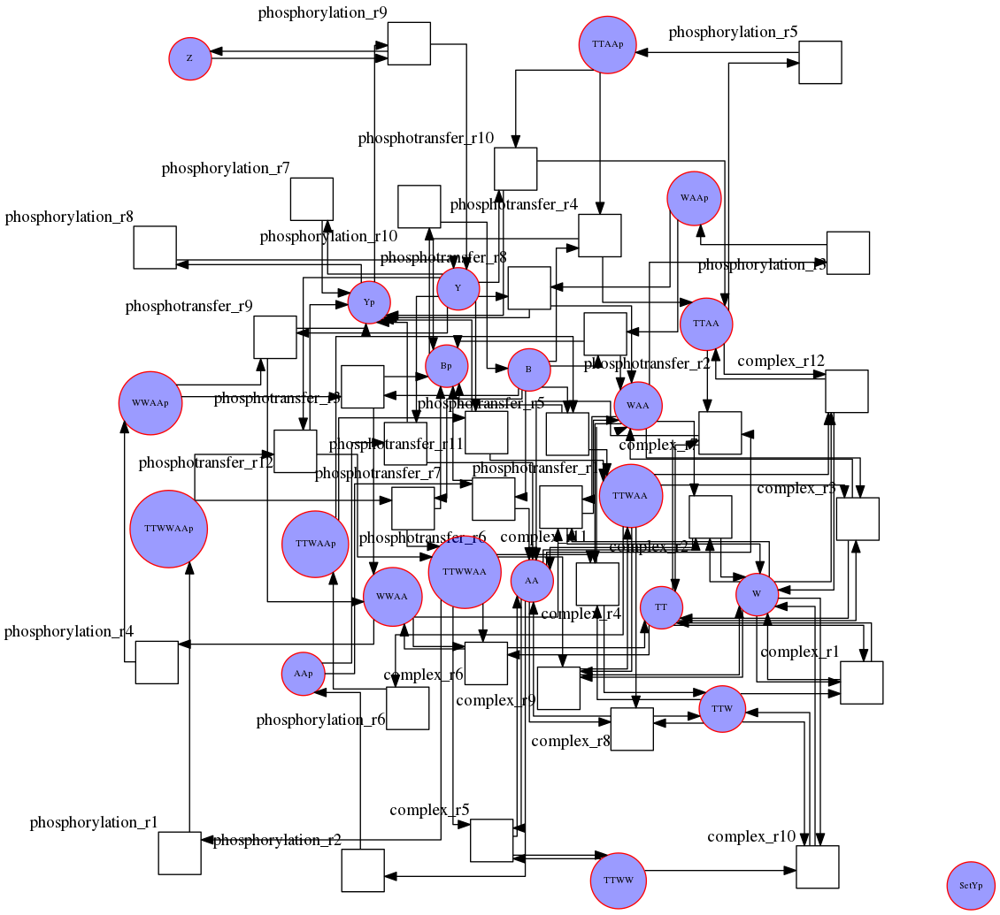

# drawsbml
Draw Signalling Pathway (SBML format)

# Dependencies

- graphviz 
    `sudo apt install graphviz`
- python-networkx 
        pip install networkx --user 
    or,
        sudo apt install python-networkx

- libsbml
    pip install python-libsbml --user 

# Usage 

    ./drawsbml.py -i ./BIOMD0000000002.xml -o a.png

# Examples

